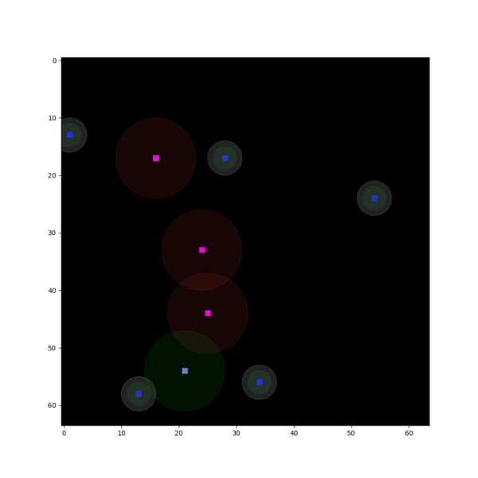
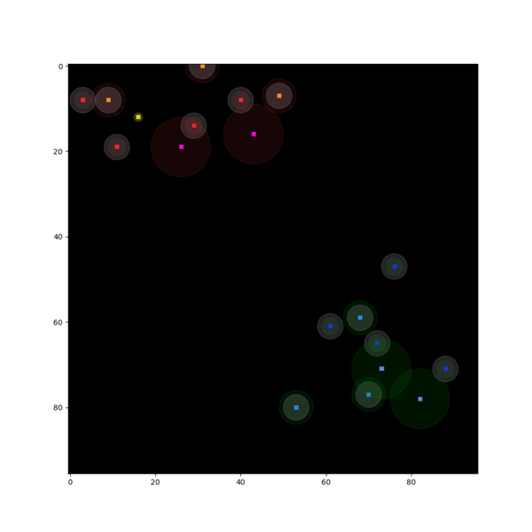
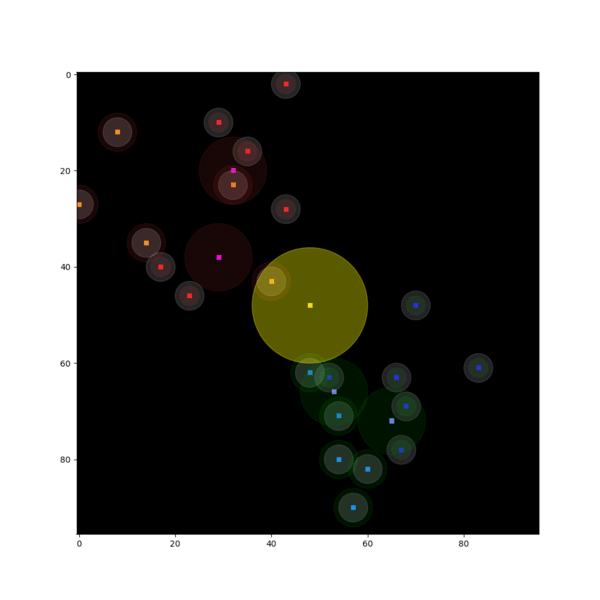

# plato

PLATO is a toolkit for multi-agent planning and execution.

To install the package, run the following commands:
```
git clone git@github.com:Liberty3000/plato.git
cd plato
pip install -e .
```
___

### Modes
| Deathmatch | Hide and Seek |
|------------|---------------|
|  |  |

| Capture the Flag | King of the Hill |
|------------|---------------|
|  |  |

|        Mode        | Description                        |
|--------------------|------------------------------------|
| Deathmatch         | A combat game mode to kill as many other players as possible until a certain condition is reached.
| Hide and Seek      | A predator-prey game mode with counter objectives of *engage* and *survive*.
| Capture the Flag   | A pursuit-based game mode with counter objectives of *stealth* and *capture*.
| King of the Hill   | A control-based game mode with the common objective of defending pre-determined spatial areas of interest.
| Search and Destroy | A customizable game mode built on multiple competing temporal objectives.
| Tactical Operation | A customizable game mode built on a composition of multiple spatiotemporal objectives.

### Notebooks

###### Tutorials
| Edition  | Topic                              |
|----------|------------------------------------|
| I        | Entity Initialization              |
| II       | Scaling Environment Parameters     |
| III      | Entity Action Space Definition     |
| IV       | Feature Space Visualization        |
| V        | Opponent Observability             |
| VI       | Scaling Opponent Observability     |
| VII      | Entity Action Space Visualization  |
| VIII     | Weapon Model Visualization         |
| IX       | Calculating Damage Maps            |
| X        | Shaping Sparse Rewards             |
| XI       | Varying Entity Initialization      |
| XII      | Testing Spatial Objectives         |
| XIII     | Testing Temporal Objectives        |
| XIV      | Testing Spatiotemporal Objectives  |
| XV       | Testing Multiple Custom Objectives |

###### Reinforcement Learning
| Edition  | Topic                              |
|----------|------------------------------------|
| I        | Off-Policy TD Control              |
| II       | On-Policy TD Control               |
| III      | Self-Play                          |
